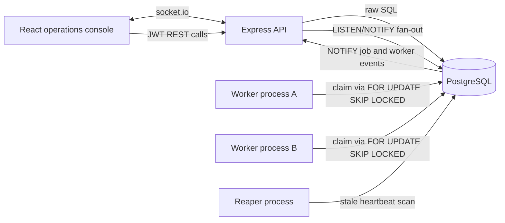

# Architecture

```mermaid
flowchart LR
  React["React operations console"] <-->|socket.io| API["Express API"]
  React -->|JWT REST calls| API
  API -->|raw SQL| PG[(PostgreSQL)]
  API -->|LISTEN/NOTIFY fan-out| PG
  WorkerA["Worker process A"] -->|claim via FOR UPDATE SKIP LOCKED| PG
  WorkerB["Worker process B"] -->|claim via FOR UPDATE SKIP LOCKED| PG
  Reaper["Reaper process"] -->|stale heartbeat scan| PG
  PG -->|NOTIFY job and worker events| API
```
