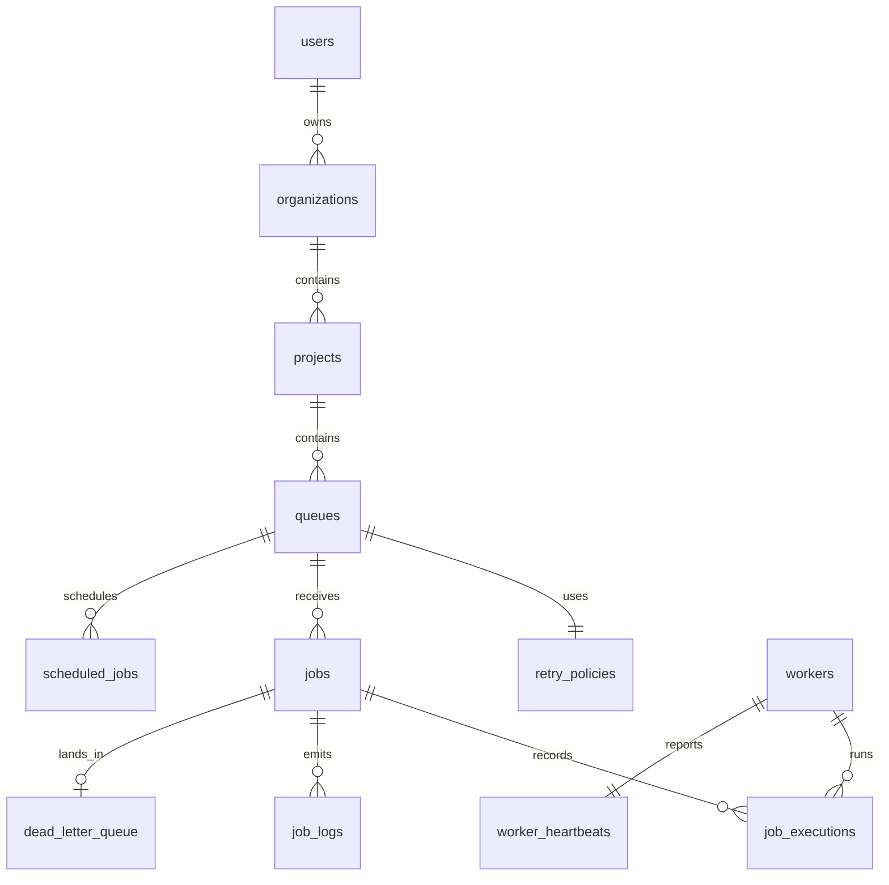

# ER Diagram

```mermaid
erDiagram
  users ||--o{ organizations : owns
  organizations ||--o{ projects : contains
  projects ||--o{ queues : contains
  queues ||--|| retry_policies : uses
  queues ||--o{ jobs : receives
  queues ||--o{ scheduled_jobs : schedules
  jobs ||--o{ job_executions : records
  jobs ||--o{ job_logs : emits
  jobs ||--o| dead_letter_queue : lands_in
  workers ||--o{ job_executions : runs
  workers ||--|| worker_heartbeats : reports
```
